# Procesverslag

Markdown is een simpele manier om HTML te schrijven.  
Markdown cheat cheet: [Hulp bij het schrijven van Markdown](https://github.com/adam-p/markdown-here/wiki/Markdown-Cheatsheet).

Nb. De standaardstructuur en de spartaanse opmaak van de README.md zijn helemaal prima. Het gaat om de inhoud van je procesverslag. Besteedt de tijd voor pracht en praal aan je website.

Nb. Door _open_ toe te voegen aan een _details_ element kun je deze standaard open zetten. Fijn om dat steeds voor de relevante stuk(ken) te doen.

## Jij

uitwerken voor kick-off werkgroep

### Auteur:

Hicham Sahla

#### Je startniveau:

Zwart

#### Je focus:

Responsive

## Je website

uitwerken voor kick-off werkgroep

### Je opdracht:

Website die ik ga namaken: https://www.basketball.nl/

#### Screenshot(s) van de eerste pagina (small screen):

hier de naam van de pagina  

#### Screenshot(s) van de tweede pagina (small screen):

hier de naam van de pagina  
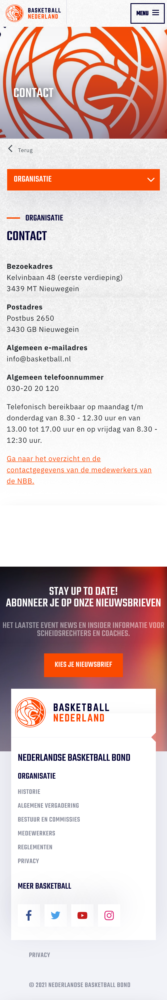

## Breakdownschets (week 1)

uitwerken na afloop 2e werkgroep

### de hele pagina:

### dynamisch deel (bijv menu):

### wellicht nog een dynamisch deel (bijv filter):

## Voortgang 1 (week 2)

uitwerken voor 1e voortgang

### Stand van zaken

Het maken van de mobiele menu ging wel goed. Ik heb de Javascript en css werkend gekregen. Ook heb ik alvast de structuur van website opgemaakt met css Grid. Zelf ben ik nog niet helemaal tevreden met de manier waarop ik de mobiele menu heb gebouwd ik heb namelijk spans gebruiks als hamburger icoon. Dit lijkt me omslachtig/onhandig ik zal hier later verbetering in moeten maken.

### Agenda voor meeting

samen met je groepje opstellen

afwezig/ziek

### Verslag van meeting

hier na afloop snel de uitkomsten van de meeting vastleggen

afwezig/ziek
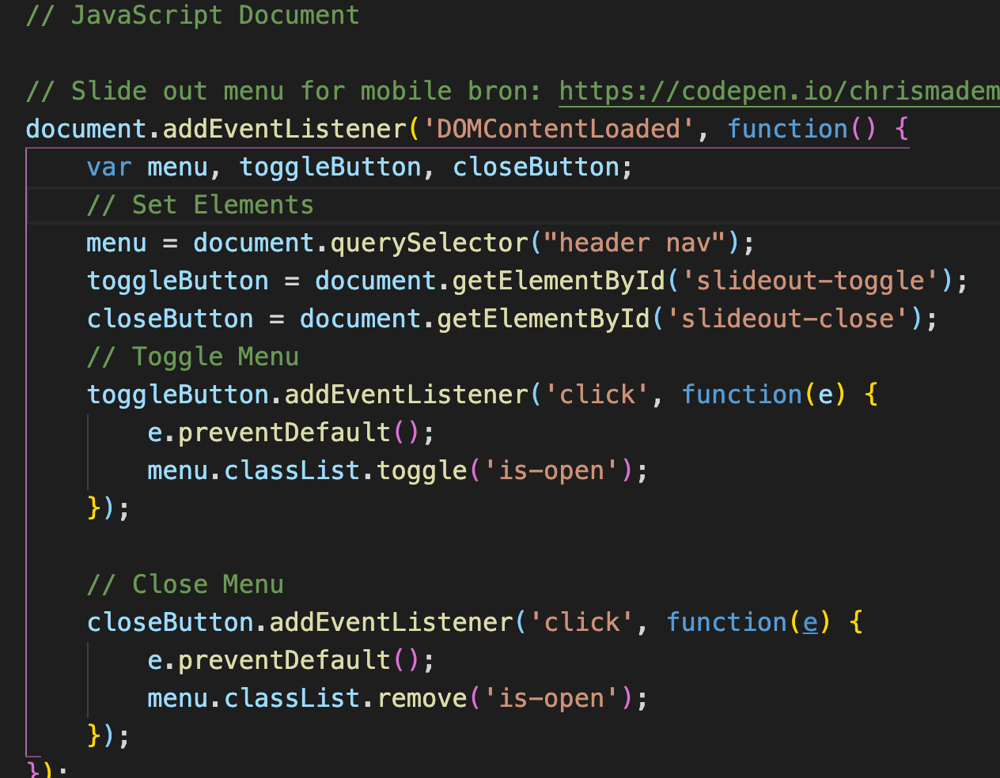
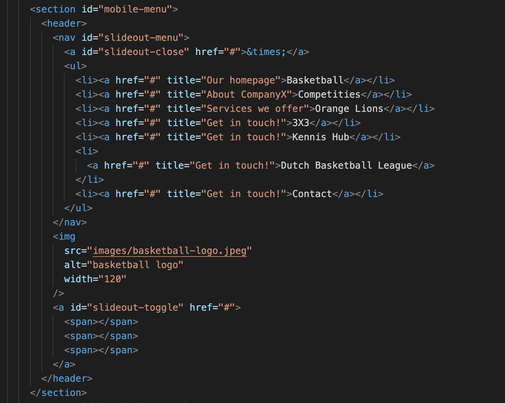
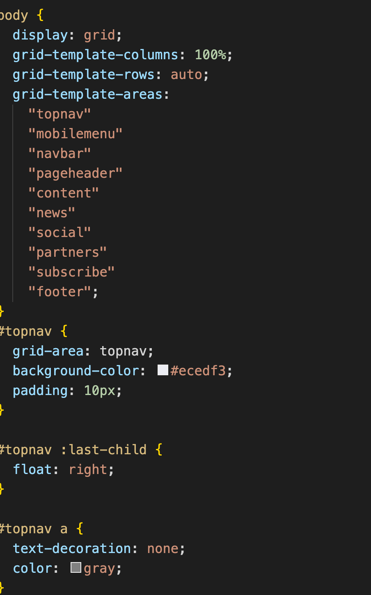

## Voortgang 2 (week 3)

uitwerken voor 2e voortgang

### Stand van zaken

Deze week heb ik gewerkt aan de social media section en partner icoon section. Het maken van de Social media sections ging vrij soepel. Daarin tegen had ik wel moeite om een slider te maken voor de partner iconen. Deze slider heb ik namelijk alleen gemaakt met css en html. Ik kreeg het niet werkend om meerdere aparte kleine afbeeldingen naast elkaar te krijgen en deze stuk voor stuk te sliden. Ik kan alleen een specifiek ding tonen en vervolgens verplaatsen voor een ander iets. ik heb uiteindelijk een omweg gevonden om met custom zelf gemaakte afbeeldingen de slider zoveel mogelijk te laten lijken zoals op de voorbeeld website.

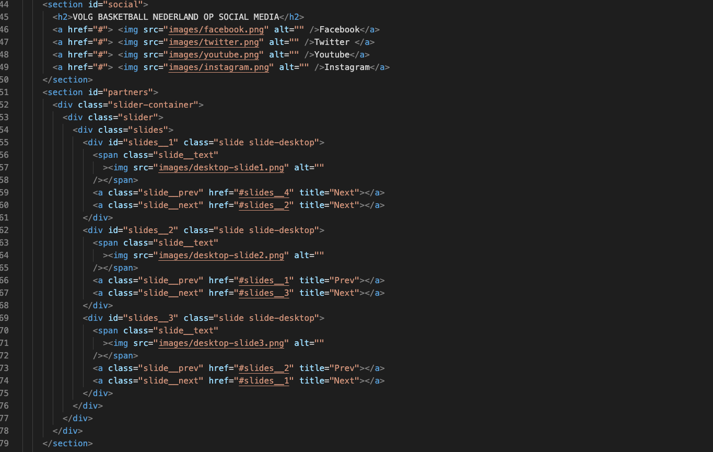
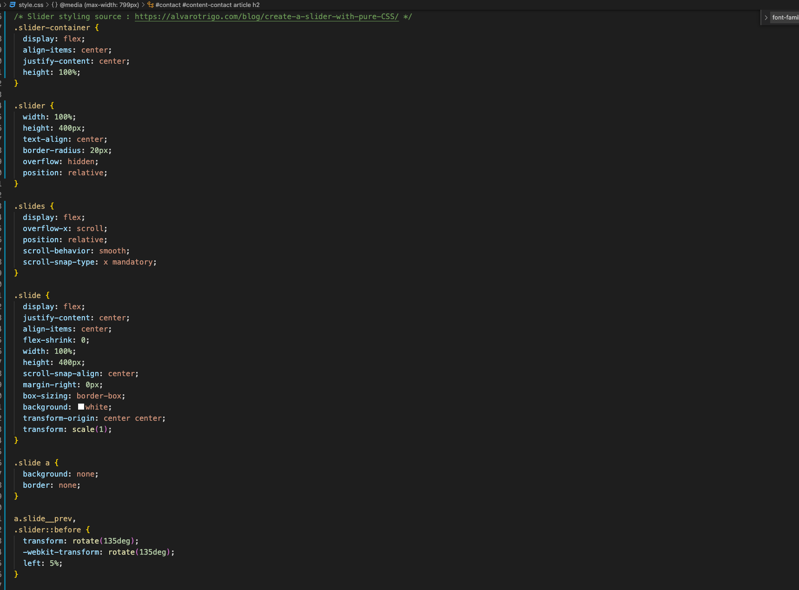
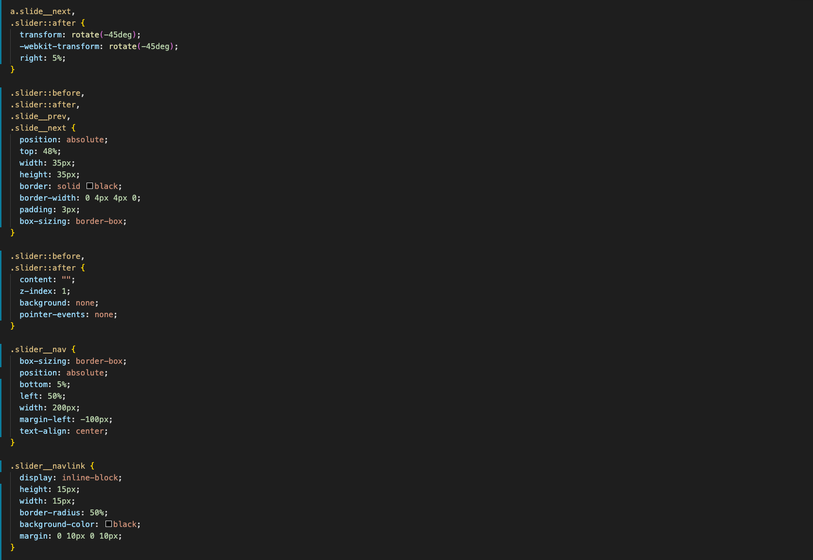

## Toegankelijkheidstest (week 4)

uitwerken na test in 8e voortgang

### Bevindingen

Op de website die ik namaak viel me op dat bij de screenreaders niet duidelijk was welke sections er waren. Bij sommige sections stonden alleen h2's en h3's bij veruit de meeste sections stond er niets

#### Titel eerste bevinding

Dropdown navigatie is niet te bedienen met het toetsenbord alleen. Je hebt de muis nodig.

Ik heb hier geen directe eenvoudige oplossing voor. Ik ga gebruik maken van een normaal menu zonder dropdown functionaliteiten

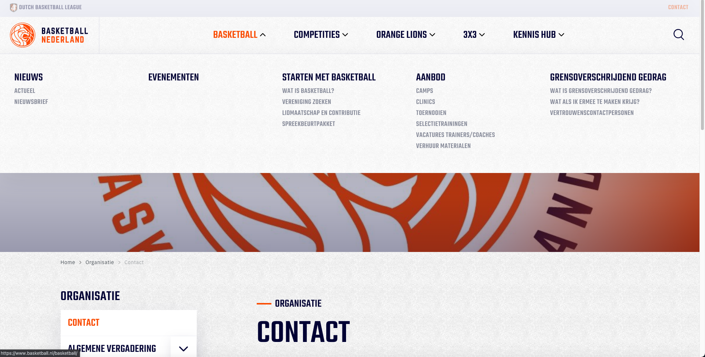

#### Titel tweede bevinding.

Ik heb de website doormiddel van een chrome extensie getest op duidelijkheid van de kleur. Deze test heb ik uitgevoerd voor bijvoorbeeld slechtziende of mensen die kleurenblind zijn.

Hieruit is gebleken dat de website erg duidelijk blijft, dit zie je duidelijk aan het contrast en kleuren die elkaar niet overlappen

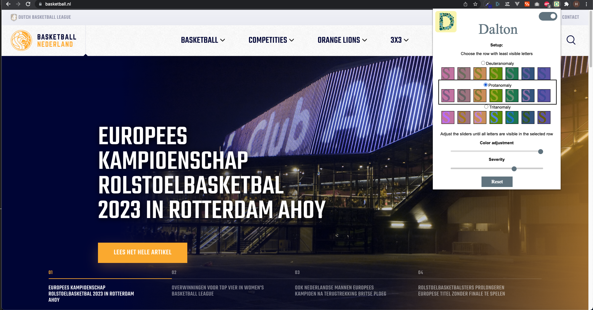
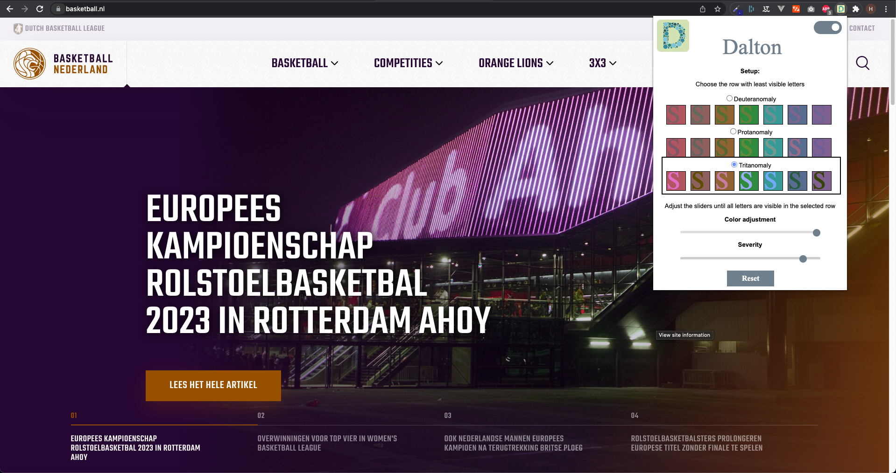

## Voortgang 3 (week 4)

uitwerken voor 3e voortgang

### Stand van zaken

Ik heb deze week de website volledig responsive gemaakt ik liep er tegen aan om de juiste afmetingen te vinden die het beste voor mij werken en de website. Verder heb ik de code meer consistent gemaakt en heb ik overbodige code die werd herhaald weg gehaald... Ik heb erg veel moeite met dat de code chaotisch begint te worden en ik door de bomen het bos niet meer kan zien. Ik ben blij met hoe ik subfooter werkend heb gekregen. De homepagina is nu helemaal af en helemaal responsive

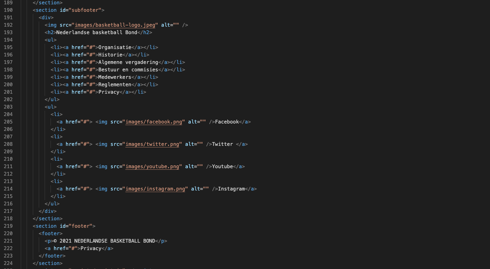
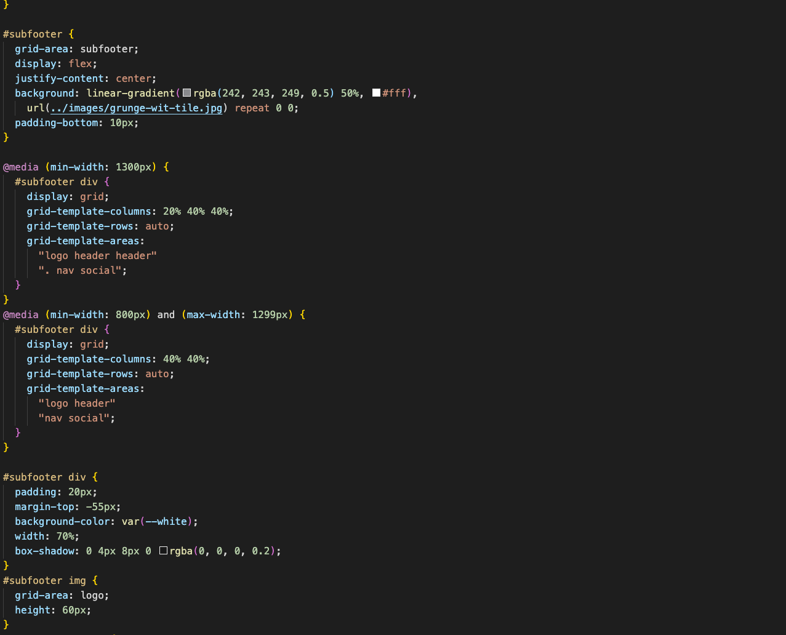
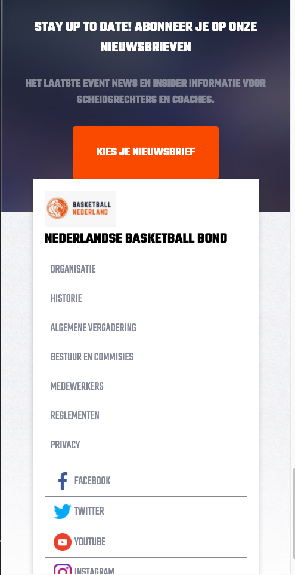

## Eindgesprek (week 5)

uitwerken voor eindgesprek

### Stand van zaken

Ik heb deze week heel veel gedaan website is volledig responsive, ik heb een accordioon gemaakt voor op de contact pagina. Ik heb de juiste fonts toegevoegd. En verder heb ik enkele kleine responsive fouten opgelost.

### Screenshot(s)

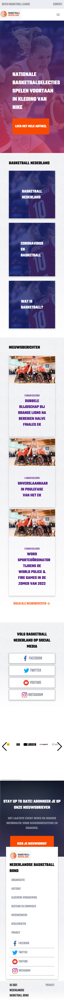

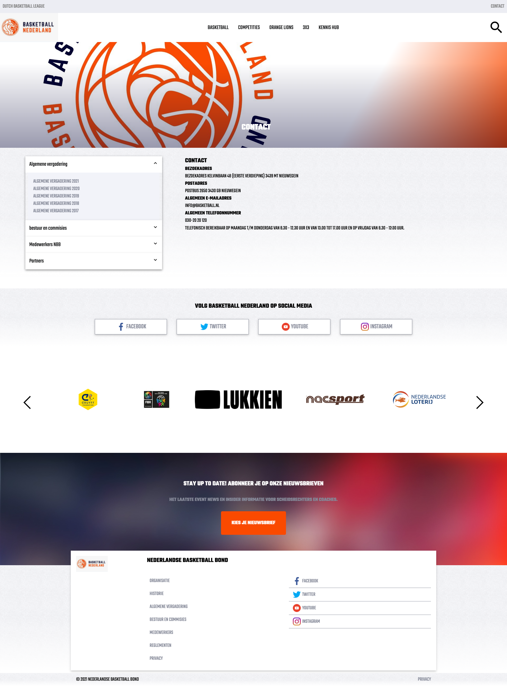
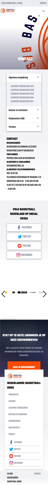

## Bronnenlijst

continu bijhouden terwijl je werkt

Nb. Wees specifiek ('css-tricks' als bron is bijv. niet specifiek genoeg).

1. Slide out menu for mobile bron: https://codepen.io/chrismademe/pen/bEMQbK
2. Slider styling source : https://alvarotrigo.com/blog/create-a-slider-with-pure-CSS/
3. Accordion source: https://codepen.io/dandiws/pen/qqyeed

